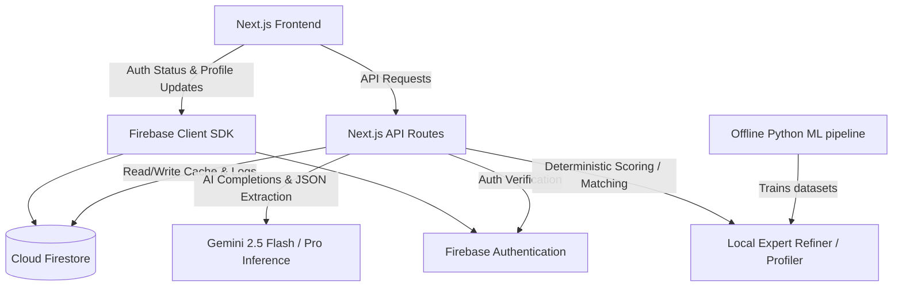
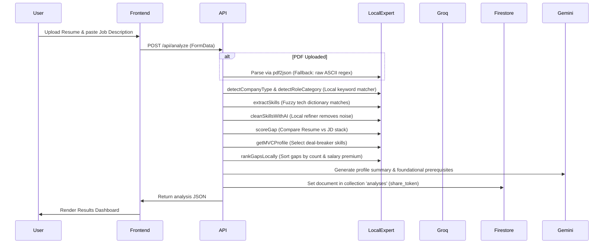

# SkillPath Long-Term Memory (MEMORY.md)

SkillPath is a high-performance career optimization platform designed to guide tech professionals in transition. By calculating the exact delta between a candidate's resume and a target job description (or career dream), it builds a precision-engineered 12-week learning roadmap with real-time tracking, salary projections, and curated learning recommendations.

---

## 1. Project Overview

### Purpose
SkillPath eliminates guesswork and information asymmetry in tech career progression. It bridges the gap between what developers write on their resumes and what ATS/recruiters look for, pruning the noise of generic courses.

### Core Functionality
- **Gap Delta Analysis**: A local extraction and scoring engine comparing resume tech stacks against job description requirements.
- **The 80/20 Syllabus**: Generates a week-by-week learning plan targeting high-impact missing technical skills.
- **Interactive Readiness Score**: A weighted calculation tracking learning progress, guiding users toward a "target score" of 80/100.
- **Interactive Skill Battle**: Allows comparative evaluation of two tech stacks (e.g., React vs. Angular) using historical job posting adoption data.
- **Role Switch Panel**: Analyzes similar or adjacent career paths where a candidate's existing skills give them a head start.
- **Career Compass & Salary Trajectory**: Visualizes career progression from Junior to Executive, along with projected salary jumps.

### Domain Context
Built with a "Cinematic Engineering" design philosophy, SkillPath targets developers, engineering managers, and technical professionals. It provides glassmorphism, responsive micro-interactions, skeuomorphic styling, and a fluid dark mode to deliver a high-quality experience.

---

## 2. System Architecture

SkillPath is structured as a single-repository Next.js web application utilizing Firebase serverless resources and Google Gemini for fast AI inference.



### High-Level Components
1. **Frontend (Next.js & React 19)**: Implements server layouts and Client Components. Animations are handled via Framer Motion, GSAP, and a Three.js particle field.
2. **Backend API (Next.js Route Handlers)**: Server-side API endpoints processing requests, verifying Firebase ID tokens, conducting local data extraction, and interfacing with Gemini.
3. **Local Expert Matching Engine**: Pure TS/JS libraries containing deterministic matching, fuzzy Levenshtein lookups, role categorization, and active tracking algorithms.
4. **Cloud Database (Firestore)**: Stores analyses, pinned active jobs, user profiles, history, and AI resource recommendation caches.
5. **Offline Machine Learning Pipeline**: Python scripts running NLP extractions, TF-IDF scoring, and SentenceTransformer clustering over job datasets to update the JSON models.

---

## 3. Technology Stack

### Core Languages
- **TypeScript & JavaScript**: Main application code.
- **Python**: Offline ML training scripts.

### Frameworks & Infrastructure
- **Next.js 15 (App Router)**: Core web application framework.
- **Firebase Admin SDK**: Server-side user authorization and firestore orchestration.
- **Gemini API client**: Central helper utility connecting routes to Gemini models via lightweight REST calls.
- **spaCy (Python)**: NLP processing of text datasets.

### UI, Styling & Animation
- **Tailwind CSS**: Core CSS utility framework.
- **Vanilla CSS (globals.css)**: Skeuomorphic classes (Liquid Glass, tactile buttons, customized themes).
- **Three.js & React Three Fiber**: Generates the 3D particle wireframe background (`GenerativeArtScene`).
- **Framer Motion**: Handles staggered transitions, fading, and modals.
- **GSAP**: Powers UI timeline scroll effects.
- **Lenis**: Provides smooth scroll kinetics.

### Persistent Databases
- **Cloud Firestore**: Serverless database managing data in real-time.
- **localStorage**: Client-side fallback for anonymous history.

### AI Models & Providers
- **Gemini 2.5 Pro**: Used for roadmap generation, complex role exploration structures, and detailed learning materials.
- **Gemini 2.5 Flash**: Lower latency model used for summary generation, verdicts, and parsing context.
- **SentenceTransformers (all-MiniLM-L6-v2)**: Computes skill embeddings offline.

---

## 4. Project Workflows & Pipelines

### Workflow A: Resume Analysis & Gap Scoring


### Workflow B: On-Demand Learning Plan Generation
1. **Trigger**: User clicks "Create Learning Plan" on the results dashboard.
2. **Auth Verification**: API checks Firebase ID token.
3. **Database Lookup**: Fetches the stored gaps and company context from the analysis document.
4. **AI Generation**: Backend invokes Gemini with `gemini-2.5-pro` utilizing `PLAN_GENERATION_SYSTEM` guidelines (requiring strictly formatted YouTube search query links instead of direct video URLs to prevent dead links).
5. **Persistence**: Saves the 12-week roadmap back to Firestore under `learning_plan` in the analysis document.
6. **Delivery**: Returns the week-by-week program structure containing project assignments.

### Workflow C: Resource Recommendation & URL Sanitization
1. **Trigger**: User opens a skill card to view tutorials, or requests alternative resources.
2. **Local Cache Check**: Checks local memory and `resources_cache` firestore collection using a hashed key (`resources:skill:role:seniority:companyType`).
3. **AI Search (if uncached)**: Calls Gemini `gemini-2.5-pro` with tier level context (Beginner, Intermediate, Advanced, Expert) and queries `resources` database collection for static curated entries.
4. **Sanitization Gate**: The server runs `sanitizeToSearchUrl` to convert any direct video links (`/watch?v=...`) generated by the LLM into safe YouTube search results URLs (`youtube.com/results?search_query=...`).
5. **Caching**: Writes results to `resources_cache` for future hits.

### Workflow D: Active Job Tracking & Readiness Recalculation
- **Pinning**: When a user pins a job, the current active job document in Firestore is archived to `/job_history/{uid}/jobs/{jobId}`. A new active job is created at `/active_jobs/{uid}` with a custom card color.
- **State Change**: When a user toggles a skill state (`not_started` ➔ `in_progress` ➔ `learned`), a PATCH request is sent.
- **Readiness Formula**: 
  $$\text{Readiness Score} = \text{round}\left(\frac{\sum (\text{Priority Weight} \times \text{State Value})}{\sum \text{Priority Weight}} \times 100\right)$$
  - Priority Weight: $\max(1, 6 - \text{Priority})$ (Priority range 1 to 5).
  - State Value: `learned` = 1.0, `in_progress` = 0.5, `not_started` = 0.
- **Committed**: Updates the database and triggers local UI animations showing percentage completion.

---

## 5. Features

### Completed Features
- **Deterministic Matcher**: Subsecond skill extraction, scoring, and ranking.
- **Active Job Pinner**: Pins target analyses as goals, archives old goals, and tracks individual skill boxes.
- **12-Week Roadmap Plan**: Generates week-by-week curriculum with projects.
- **Skill Battle**: Local database comparison of adoption counts, salary premiums, and YoY trends.
- **Fuzzy Self-Correction Refiner**: Cleans spelling errors, removes noise words, and normalizes skill naming.
- **Freshness Score Card**: Analyzes resume skills to penalize deprecated stacks (e.g. jQuery) and reward rising technologies.
- **Role Switch Panel**: Computes match percentages for adjacent roles using a pre-calculated mapping.
- **Cinematic smooth scrolls & 3D background scale**: Particle simulation reacts to page scrolling.

### Partially Implemented Features
- **Dream Onboarding**: An AI calibration assistant to help users refine text, though relying heavily on raw text pasting for the resume part.
- **Foundational Prerequisites**: Extracts 3 baseline concepts missing from the resume. Defaults to standard templates (Git, Data Structures, CLI) if API requests fail.

### Planned Features
- **Direct Integration with Learning Platforms**: Scraping and recommending direct links to Coursera, Udemy, or edX.
- **Automatic Resume Modifier**: Drafts bullet points to highlight skills matching a job description.

### Experimental Features
- **Limelight Nav Spotlight**: Interactive navbar hover highlight testing sandbox inside `/_development/limelight-demo`.
- **Anomalous Matter Wireframe Background**: Custom WebGL vertex shaders responding directly to page scrolling velocities.

---

## 6. Backend Analysis

The backend operates via Next.js Route Handlers (`skillpath/app/api/`).

### Route Structure
- `api/analyze/route.ts`: Evaluates resume & JD. Local keyword extractor combined with Gemini 2.5 Flash summary generation.
- `api/active-job/route.ts`: GET fetches pinned job, POST pins a new one, PATCH modifies active skill state.
- `api/battle/ai/route.ts`: Gemini 2.5 Flash endpoint providing a verdict sentence comparing two technologies.
- `api/explore/route.ts`: Parses raw title, produces a comprehensive category tree and learning roadmap.
- `api/generate-resources/route.ts`: Multi-level course recommendations (Beginner to Expert) with server-side URL sanitization.
- `api/profile/route.ts`: Handles profile creation on first login, updates avatar color and target role.
- `api/results/[id]/route.ts`: Serves stored analysis documents (stripping raw text for public privacy).
- `api/results/[id]/plan/route.ts`: Generates a custom 12-week roadmap.

### Error Handling & Middlewares
The application checks headers in route entry gates.
- `AuthError` handles:
  - `NO_TOKEN` (401 Unauthorized)
  - `INVALID_TOKEN` (401 Session expired)
  - `FIREBASE_UNAVAILABLE` (503 Service unavailable)
- Edge routes are run on standard `nodejs` runtime for package compatibility with `pdf2json`.

---

## 7. Frontend Analysis

### Page Layouts
- `app/page.tsx`: Core homepage. Animates background coordinates according to scroll velocity.
- `app/analyze/page.tsx`: Drag-and-drop or copy-paste container with auto-firing trigger thresholds.
- `app/results/[id]/page.tsx`: The primary dashboard containing readiness meters, skill cards, career path maps, and accordion roadmap schedules.
- `app/explore/[share_token]/page.tsx`: View-only Server Component page for shareable skill maps.
- `app/profile/page.tsx`: Display name editor, learning progress metrics, streak badges, and timeline rails.

### Core Reusable UI Components
- `anomalous-matter-hero.tsx`: Implements React Three Fiber 3D Canvas rendering custom vertex shader nodes.
- `flow-field-background.tsx`: Renders canvas-based mathematical particle lines.
- `limelight-nav.tsx`: A premium navigation bar spotlight tracking cursor coordinates.
- `SmoothScrolling.tsx`: Lenis smooth scroll wrapper.
- `SelfAssessmentModal.tsx`: Confidence level popup rating gaps from "Never Used" to "Strong".

---

## 8. Database Architecture

SkillPath uses Google Cloud Firestore. Since it is NoSQL, schemas are represented as TypeScript interfaces.

### Collections Overview

#### Collection: `analyses`
- **Doc ID**: Share Token (UUID)
- **Key Fields**:
  ```typescript
  interface AnalysisResult {
    share_token: string;
    gap_score: number;
    mvc_skills: string[];
    ready_by_date: string;
    weeks_required: number;
    company_type: string;
    role_category?: string;
    role_label?: string;
    jd_skills: string[];
    resume_skills: string[];
    skill_gaps: SkillGap[];
    learning_plan?: LearningPlan;
    jd_preview: string;
    summary?: string;
    created_at: string;
    generated_resources?: Record<string, SkillResources>;
    assessments?: Record<string, ConfidenceLevel>;
    matched_skills?: string[];
    trajectory?: TrajectoryInfo;
    foundational_prerequisites?: string[];
  }
  ```

#### Collection: `active_jobs`
- **Doc ID**: Firebase User UID
- **Key Fields**:
  ```typescript
  interface ActiveJob {
    id: string;
    analysis_id: string;
    job_title: string;
    company_type: string;
    role: string;
    seniority: string;
    pinned_at: string;
    color: string;
    skills: TrackedSkill[];
    readiness_score: number;
  }
  ```

#### Collection: `profiles`
- **Doc ID**: Firebase User UID
- **Key Fields**:
  ```typescript
  interface UserProfile {
    uid: string;
    display_name: string;
    email: string;
    avatar_color: string;
    streak_count: number;
    streak_last_date: string;
    total_skills_learned: number;
    created_at: string;
    target_role?: string;
  }
  ```

#### Collection: `job_history/{userId}/jobs`
- **Doc ID**: Job ID
- **Key Fields**: Complete `ActiveJob` document fields with additional `archived_at` and `final_score` timestamps.

#### Collection: `resources_cache`
- **Doc ID**: MD5/SHA representation of key strings (`resources:skill:role:seniority:companyType`)
- **Key Fields**: Recommendations array and `expiresAt` (7-day TTL).

---

## 9. API Reference

### Internal API Endpoints

#### `POST /api/analyze`
- **Auth**: Required (Bearer ID token in `Authorization` header)
- **Content-Type**: `multipart/form-data`
- **Parameters**:
  - `jd_text` (string, required): Paste target job text.
  - `resume_file` (File, optional): Uploaded PDF resume.
  - `resume_text` (string, optional): Pasted resume text (if no file).
  - `dream_role`, `current_role`, `experience_level`, `target_company` (string, optional)
- **Response**: `200 OK` returning `AnalysisResult` JSON document.

#### `POST /api/results/[id]/plan`
- **Auth**: Required
- **Parameters**: `id` in URL parameter.
- **Response**: `200 OK` returning `LearningPlan` JSON document containing the 12-week roadmap.

#### `POST /api/active-job`
- **Auth**: Required
- **Parameters**: JSON body containing `{ analysis_id, job_title, company_type, role, seniority, skills }`.
- **Response**: `201 Created` with initialized `ActiveJob` document.

#### `PATCH /api/active-job`
- **Auth**: Required
- **Parameters**: JSON body containing `{ skill: string, state: 'not_started' | 'in_progress' | 'learned' }`.
- **Response**: `200 OK` returning recalculated `{ readiness_score, next_skill, skills }`.

#### `POST /api/generate-resources`
- **Auth**: Optional
- **Parameters**: JSON body containing `{ analysis_id, skill, role, seniority, company_type, existing_urls, click_count }`.
- **Response**: `200 OK` returning `{ skill, skill_resources, from_cache }`.

#### `POST /api/explore`
- **Auth**: Optional
- **Parameters**: JSON body containing `{ job_title: string }`.
- **Response**: `200 OK` returning dynamic exploration roadmap and skill map.

---

## 10. Environment Variables

Create a `.env.local` inside the `/skillpath` folder:

| Variable Name | Purpose | Scope | Required |
| :--- | :--- | :--- | :--- |
| `GEMINI_API_KEY` | Connects system to Gemini model inference | Backend routes | Yes |
| `NEXT_PUBLIC_FIREBASE_API_KEY` | Initialise Firestore & Auth in browser client | Client SDK | Yes |
| `NEXT_PUBLIC_FIREBASE_AUTH_DOMAIN` | Project authentication domain | Client SDK | Yes |
| `NEXT_PUBLIC_FIREBASE_PROJECT_ID` | Targets proper Firebase application | Client & Server | Yes |
| `NEXT_PUBLIC_FIREBASE_STORAGE_BUCKET` | Reference storage instances | Client SDK | Yes |
| `NEXT_PUBLIC_FIREBASE_MESSAGING_SENDER_ID` | Analytics & push message triggers | Client SDK | Yes |
| `NEXT_PUBLIC_FIREBASE_APP_ID` | Uniquely identifies Client App | Client SDK | Yes |
| `NEXT_PUBLIC_FIREBASE_MEASUREMENT_ID` | Google Analytics linkage | Client SDK | Optional |
| `FIREBASE_SERVICE_ACCOUNT_BASE64` | Base64 representation of Service Account JSON | Server Admin | Yes (or individual fields) |
| `FIREBASE_PROJECT_ID` | Fallback parameter for Admin SDK credentials | Server Admin | Optional (fallback) |
| `FIREBASE_CLIENT_EMAIL` | Fallback parameter for Admin SDK credentials | Server Admin | Optional (fallback) |
| `FIREBASE_PRIVATE_KEY` | Fallback parameter for Admin SDK credentials | Server Admin | Optional (fallback) |

---

## 11. Core Dependencies

### Node/Web Packages (`package.json`)
- **`next`**: Framework engine routing.
- **`firebase` / `firebase-admin`**: Client-server persistence.
- **Gemini API client utility**: Handles standard REST requests to Gemini endpoint hosts.
- **`pdf2json`**: Extracts plain text from binary PDF data.
- **`framer-motion` / `gsap`**: Core animation engines.
- **`three` / `@react-three/fiber` / `@react-three/drei`**: Powers the interactive 3D particle background.
- **`lru-cache`**: In-memory cache for API requests.
- **`lenis`**: Provides cinematic page scrolling.

### Python ML Packages (`requirements-ml.txt`)
- **`spacy`**: Extracts nouns for skill classification.
- **`sentence-transformers`**: Generates embeddings for fuzzy grouping.
- **`pandas`**: Handles tabular dataset manipulation.
- **`scikit-learn`**: Implements TF-IDF scoring pipelines.

---

## 12. Directory Guide

```text
├── data/                       # Ground-truth raw datasets for ML training
├── scripts/                    # Offline training Python pipelines (TF-IDF, clustering)
└── skillpath/                  # Next.js Application Root
    ├── app/                    # Next.js App Router folders & REST route files
    │   ├── _development/       # Sandbox area for skeuomorphic components
    │   ├── api/                # Sub-routes exposing backend routes
    │   └── explore/            # Skill tree listing page routers
    ├── components/             # Reusable UX Components (organized by feature)
    │   ├── analyze/            # File loaders & dream calibrators
    │   ├── explore/            # Interactive maps & Skill Battle panels
    │   ├── landing/            # Landing components
    │   ├── profile/            # Progress dashboards
    │   ├── results/            # Meter wheels & confidence assess panels
    │   └── ui/                 # Core skeuomorphic blocks & R3F canvases
    ├── context/                # Auth & Global UI React State Providers
    ├── data/                   # Core backup models
    ├── lib/                    # Helper scripts (fuzzy scoring, db, cleaners)
    │   ├── data/               # Model JSONs containing weights, salary averages, and trends
    │   └── utils/              # Shared helper functions (fuzzy matches, calculations)
    ├── prompts/                # Strict templates driving Gemini responses
    └── types/                  # Shared TypeScript types
```

---

## 13. Important Files

- `skillpath/app/api/analyze/route.ts`: Coordinates the core hybrid analysis pipeline (matching resume vs. JD).
- `skillpath/lib/mvc-profiler.ts`: The central algorithmic library for classification, skill extraction, and seniority mapping.
- `skillpath/lib/ai-skill-cleaner.ts`: Implements a multi-layered local dictionary and fuzzy logic system to clean and autocorrect spelling in extracted skills without API costs.
- `skillpath/lib/confidence-reweighter.ts`: Pure client-side calculations that update score meters based on user confidence selections.
- `skillpath/lib/resource-generator.ts`: Manages course recommendations, Firestore caching, and link sanitization.
- `skillpath/lib/pdf-extract.ts`: Extracts text from PDF files using a structured parse with a raw ASCII scan fallback.
- `skillpath/lib/firebase-admin.ts`: A lazy-initialized singleton that prevents connection leaks.
- `skillpath/firestore.rules`: Security rules enforcing authorization scopes on user documents.

---

## 14. Configuration Reference

- **`next.config.ts`**: Configures `pdf2json` as an external server package to prevent Next.js from bundling it on the client side.
- **`tsconfig.json`**: Configures path alias mapping (e.g. `@/*` maps to `skillpath/*`).
- **`tailwind.config.ts`**: Implements custom CSS variables, custom typography sizes (`display-lg`, `title-lg`), and animations.
- **`eslint.config.mjs`**: Code linting rules.

---

## 15. Build System

The project uses Next.js CLI.

### Developer Commands
- Run development server (with Turbopack):
  ```bash
  npm run dev
  ```
- Build production package:
  ```bash
  npm run build
  ```
- Start production server:
  ```bash
  npm run start
  ```
- Expose local server for integration testing:
  ```bash
  npm run dev:tunnel
  ```

---

## 16. Deployment Workflow

- **Hosting**: Deployed on Vercel.
- **Functions Max Duration**: The `/api/analyze` function is configured with `maxDuration: 30` to prevent Vercel from timing out during heavy PDF parse tasks.
- **Security Check**: Environmental variables must be injected into Vercel settings. For Firebase Admin, compile the service account JSON into a Base64 string and assign it to `FIREBASE_SERVICE_ACCOUNT_BASE64` to prevent newline escapes from corrupting the private key.

---

## 17. AI System Architecture

SkillPath uses a hybrid approach: local calculations handle extraction and scoring, while AI models handle synthesis tasks.

### Orchestration Mechanics
1. **Fallback Chains**: Gemini calls default to `gemini-2.5-pro` for maximum logical synthesis, and automatically fall back to `gemini-2.5-flash` if rate limits or endpoint availability issues are encountered.
2. **Backoff Retries**: If a 429 rate limit is hit, calls wait with a progressive backoff delay of 5s, 10s, etc., before retrying.
3. **Structured Output**: AI prompts enforce JSON formatting. In `callGeminiJSON`, markdown formatting ticks (e.g., ` ```json `) are automatically stripped before parsing to prevent JSON parse failures.

---

## 18. Security Architecture

- **Token Audits**: Backend handlers inspect the HTTP `Authorization` header, extract the Bearer token, and verify it using Firebase Admin (`verifyIdToken`).
- **Access Control (Firestore Rules)**:
  - Analyses are publicly readable via their token (`docId`), but directory listings are blocked to protect privacy.
  - Profiles and active jobs are restricted to their owner using `request.auth.uid == userId`.
- **Database Safety**: `getDb().settings({ ignoreUndefinedProperties: true })` is set globally to prevent Firestore from crashing on undefined JavaScript properties.

---

## 19. Current Development Status

- **Stable Features**: Core analysis scoring, active job tracking, local expert skill cleaner, skill battle, alternate role panel, and localized local storage history.
- **In-Progress Features**: Three.js particle scaling during scroll transitions (needs minor physics calculations to prevent performance lag on lower-end devices).
- **Roadmap**:
  - Auto-drafting resume enhancements matching identified gaps.
  - Integrations with online educational platforms.
- **Limitations**: Scanned or image-only PDF resumes cannot be parsed via the local PDF extractor and require manual copy-pasting.

---

## 20. Developer Notes & Pitfalls

> [!WARNING]
> **Vercel Private Key Quote Wrapping**:
> In Vercel environment portals, pasting a private key with surrounding quotes can lead to formatting issues. `firebase-admin.ts` addresses this by stripping leading and trailing quotes and formatting `\n` characters:
> ```typescript
> formattedKey = privateKey.replace(/\\n/g, '\n');
> if (formattedKey.startsWith('"') && formattedKey.endsWith('"')) {
>   formattedKey = formattedKey.slice(1, -1);
> }
> ```

> [!IMPORTANT]
> **YouTube Link Sanitization**:
> Gemini models may occasionally return direct YouTube video URLs despite instructions. To prevent broken links, `resource-generator.ts` filters and converts all URLs to search queries:
> ```typescript
> function sanitizeToSearchUrl(url: string, title: string): string {
>   // Converts youtube.com/watch?v=xxx to youtube.com/results?search_query=...
> }
> ```
> Every recommended resource must pass `isValidYouTubeSearchUrl` to be rendered in the UI.

> [!NOTE]
> **Firebase Admin Singletons**:
> Always use `getDb()` and `getAdminAuth()` getters rather than global variables. Under hot-reload conditions in Next.js development mode, global variables can duplicate, throwing duplicate initialization errors. Using getters avoids this.

> [!TIP]
> **PDF Parsing Casting**:
> `pdf2json` does not have standard ES6 default exports. In TypeScript, it must be cast as a constructor to prevent type errors:
> ```typescript
> const parser = new (PDFParser as any)(null, true);
> ```
