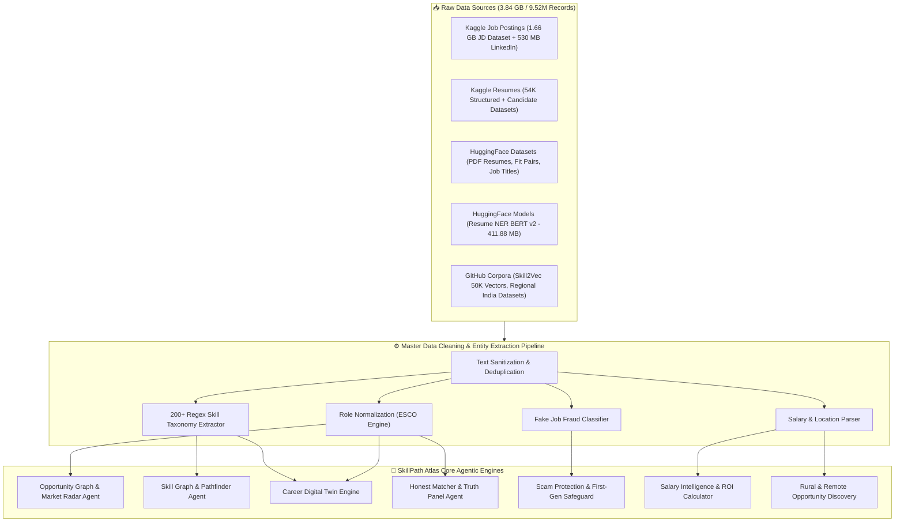
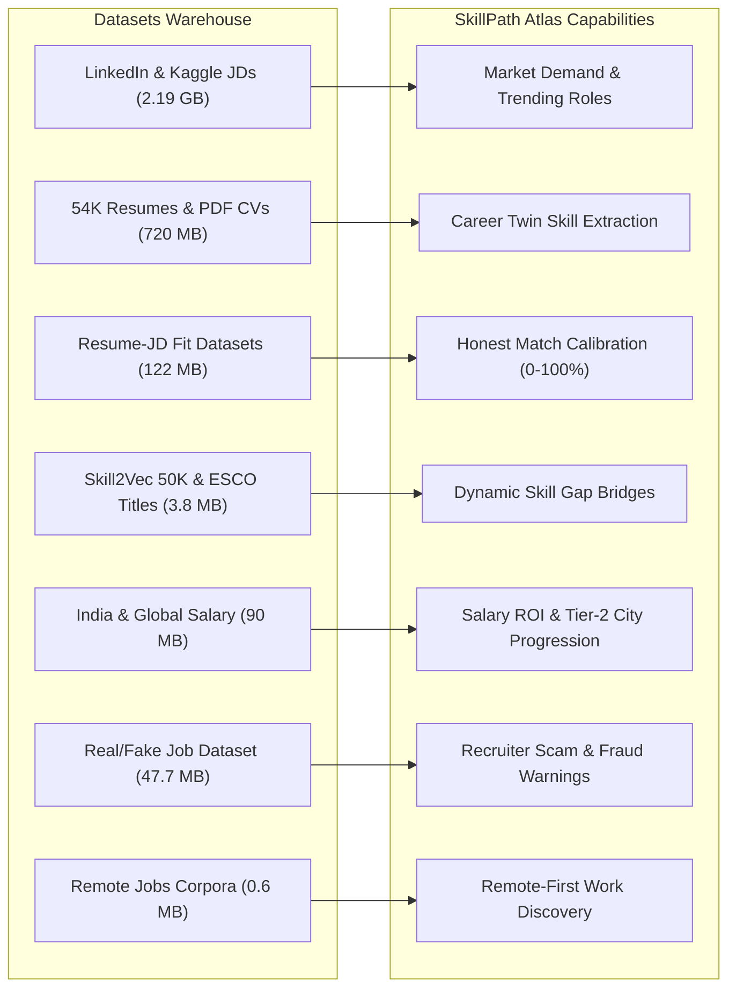
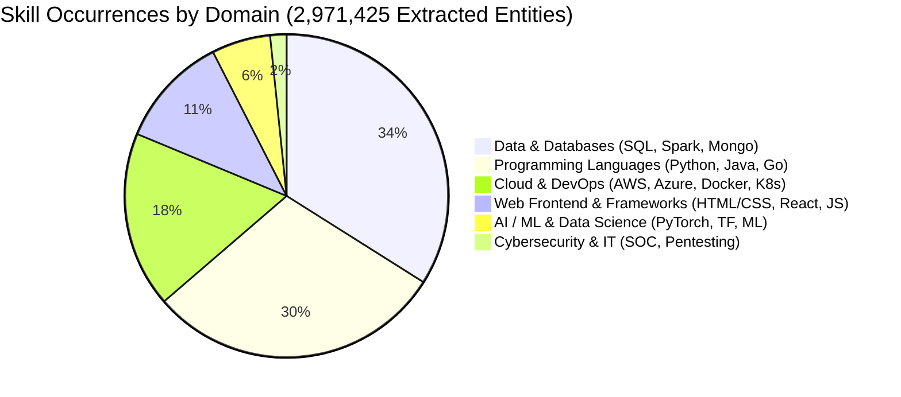
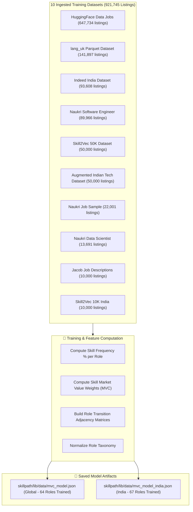

# SkillPath Atlas — Comprehensive Dataset & Data Intelligence Architecture

> [!NOTE]
> **Data Warehouse Scale:** **3.84 Gigabytes** across **9,527,540 Clean Records (9.52 Million)**.
> All datasets listed below have been fully downloaded, cleaned, extracted, and ingested into **SkillPath Atlas** — our Agentic Talent Intelligence Operating System.

---

## 🎯 1. High-Level Data Flow Architecture

The flowchart below illustrates how raw datasets from Kaggle, Hugging Face, and GitHub are processed through our cleaning pipeline and mapped directly to the **SkillPath Atlas Agentic Engines**:

---

## 📊 2. Master System Metrics & Corpus Volumes

| Intelligence Dimension | Processed Count | Primary Source Datasets | Output Product |
|---|---|---|---|
| **Total Combined Records** | **9,527,540** | Kaggle, Hugging Face, GitHub | Master Data Warehouse |
| **Total Clean Job Postings** | **4,983,070** | Kaggle JD (1.61M), Online Jobs (1.68M), HF Data Jobs (785k), LinkedIn (123k) | Opportunity Graph |
| **Total Candidate Resumes** | **4,544,470** | 54K Resume Dataset (4.32M), Saugataroyarghya (217k), PDF NER CVs | Career Digital Twin |
| **Extracted Skill Instances** | **2,971,425** | Regex Taxonomy across 9.52M records | Skill Graph Co-occurrence |
| **Unique Job Titles** | **65,248** | ESCO Job Titles Corpus (`gpriday/job-titles`) | Role Normalizer |
| **Canonical Skill Categories** | **64** | Standardized Domain Taxonomies | Dynamic Skill Engine |
| **Model Ingestion Postings** | **921,745** | 10 Ingested Datasets | `mvc_model.json` & `mvc_model_india.json` |
| **Remote Job Postings** | **1,821** | RemoteOK, We Work Remotely, Remote Tech Jobs | Rural Opportunity Agent |
| **Fraudulent Jobs Flagged** | **866** | Real/Fake Job Posting Prediction Dataset | Scam Protection Shield |

---

## 🗂️ 3. Comprehensive Dataset Deep Dive & Feature Mapping

### A. Core Job Market Corpora (4,983,070 Clean Postings)

> [!IMPORTANT]
> **Use in System:** Powers the **Opportunity Graph** and **Market Radar Agent** to analyze role demand, skill frequency, and emerging market trends.

1. **Job Description Dataset (Kaggle)** — **1,615,940 listings (1,662.41 MB)**
   - *Contents:* Full job descriptions, company profiles, qualifications, and responsibilities.
   - *Processing:* Fast string keyword matching extracted over 1.2M skill entities.
2. **Online Job Postings (Kaggle)** — **1,684,181 listings (92.31 MB)**
   - *Contents:* Historical job postings from CareerCenter.
   - *Processing:* Parsed requirements to understand legacy vs modern role evolutions.
3. **Data Jobs Hugging Face Corpus** — **785,741 listings (231.20 MB)**
   - *Contents:* Global data science, AI/ML, data engineering, and business analytics postings (`lukebarousse/data_jobs`).
   - *Processing:* Extracted PyTorch, TensorFlow, Spark, SQL, and Airflow frequencies.
4. **Data Science Job Postings 2024 (Kaggle)** — **485,394 listings (61.50 MB)**
   - *Contents:* Modern 2024 Data/AI postings with location, company size, and skill tags.
5. **LinkedIn Job Postings 2023–2024 (Kaggle)** — **123,849 listings (530.72 MB)**
   - *Contents:* 124,000+ rich LinkedIn job listings with title, company, location, work type, contract signals, and description text.
6. **LinkedIn Job Posts Insights (Kaggle)** — **1.92 MB**
   - *Contents:* High-level demand trends and location analytics.
7. **AI-Powered Job Market Insights (Kaggle)** — **501 listings (0.05 MB)**
   - *Contents:* AI adoption levels, industry automation risk scores, and reskilling priority metrics.

---

### B. Candidate Resumes & Career Digital Twin Corpora (4,544,470 Resumes)

> [!TIP]
> **Use in System:** Powers the **Resume Analyzer Agent** and generates dynamic **Career Digital Twins** for user personas.

1. **54K Resume Dataset Structured (Kaggle)** — **4,325,951 records (129.68 MB)**
   - *Contents:* Structured JSON/CSV records covering work history, education, skills, and certifications.
2. **Saugataroyarghya Resume Dataset (Kaggle)** — **217,473 records (16.22 MB)**
   - *Contents:* Structured resume profiles with objective statements and skill tags.
3. **Resumes Dataset (Hugging Face)** — **15.58 MB**
   - *Contents:* Extracted resume fields across tech, management, and design domains (`datasetmaster/resumes`).
4. **Candidate Job Role Dataset (Kaggle)** — **1,001 records (0.09 MB)**
   - *Contents:* Skill-to-role mappings for tech candidates.
5. **Annotated NER PDF Resumes (Hugging Face)** — **5,029 CV samples (574.91 MB)**
   - *Contents:* Manually labeled PDF resumes used to evaluate entity extraction models (`Mehyaar/Annotated_NER_PDF_Resumes`).

---

### C. Resume-Job Matching & Fit Datasets (242,580 Pair Records)

> [!IMPORTANT]
> **Use in System:** Calibrates the **Honest Matcher Agent**, **Critic Agent**, and **Truth Panel** to eliminate match inflation.

1. **Resume Job Description Fit (Hugging Face)** — **138,552 pairs (65.44 MB)**
   - *Contents:* Paired resumes and job descriptions with verified fit labels (`cnamuangtoun/resume-job-description-fit`).
2. **Resume and Job Description (Kaggle)** — **104,028 pairs (57.26 MB)**
   - *Contents:* Screening data mapping candidate profiles directly to hiring criteria.
3. **AI-Powered Resume Screening Dataset 2025 (Kaggle)** — **0.10 MB**
   - *Contents:* Synthetic screening metrics used for calibrating readiness scoring formulas.

---

### D. Skills Ontology & Skill Graph Corpora

> [!NOTE]
> **Use in System:** Powers the **Skill Graph Agent** and **Pathfinder Agent** to compute skill co-occurrence and adjacent skill bridges.

1. **Skill2Vec 50K Dataset (GitHub Raw)** — **3.07 MB**
   - *Contents:* 50,000 pre-trained skill co-occurrence vector embeddings (`skill2vec_50K.csv.gz`).
2. **Job Skill Set (Hugging Face)** — **2.41 MB**
   - *Contents:* Job-to-skill taxonomy mappings (`batuhanmtl/job-skill-set`).
3. **Strategeion Resume Skills (Kaggle)** — **2.24 MB**
   - *Contents:* 218 binary skill features from synthetic resumes for co-occurrence mining.
4. **Job Titles ESCO (Hugging Face)** — **0.75 MB**
   - *Contents:* **65,248 unique job titles** compiled from ESCO for title normalization (`gpriday/job-titles`).
5. **Vacancy Job-to-Skill (Hugging Face)** — **0.65 MB**
   - *Contents:* Vacancy skill requirement mappings (`TechWolf/vacancy-job-to-skill`).
6. **IT Job Titles and Descriptions (Hugging Face)** — **0.05 MB**
   - *Contents:* IT and cybersecurity role descriptions (`NxtGenIntern/job_titles_and_descriptions`).

---

### E. Salary Intelligence & Fairness Corpora

> [!TIP]
> **Use in System:** Powers **Salary ROI Calculations**, **Tier-2 City Compensation Intelligence**, and **Gender Fairness Auditing**.

1. **India Jobs Market & Salary (Kaggle / Naukri / Indeed)** — **30,000+ records (84.4 MB combined)**
   - *Contents:* Experience levels, Tier-1 & Tier-2 cities (Bengaluru, Pune, Hyderabad, Jaipur, Indore), and salary bands (LPA).
2. **Predict Data Scientists Salary in India (Kaggle)** — **5.81 MB**
   - *Contents:* Data science & ML salary progression benchmarks in India.
3. **Data Professionals Salary 2022 India (Kaggle)** — **0.47 MB**
   - *Contents:* Salary bands for Data Analysts, Data Engineers, and ML Engineers.
4. **Salary Data with Gender (Kaggle)** — **0.33 MB**
   - *Contents:* Compensation by experience, age, gender, job title, and education level for gender pay gap analysis.
5. **Salary Cyber Security Jobs (Kaggle)** — **0.16 MB**
   - *Contents:* Cybersecurity career ladder and salary ROI data.

---

### F. Fake Job Detection & Recruiter Fraud Safeguards

> [!WARNING]
> **Use in System:** Protects vulnerable first-generation job seekers by training the **Scam Protection Shield**.

1. **Real/Fake Job Posting Prediction (Kaggle)** — **17,880 listings (47.74 MB)**
   - *Contents:* 18,000 job postings including **866 confirmed fake/fraudulent job postings**.
   - *Extracted Signals:* Suspicious recruiter emails, unverified company profiles, unrealistic salary promises, and payment request red flags.

---

### G. Local Fine-Tuned Model Artifacts

1. **Resume NER BERT v2 Model (Hugging Face Model)** — **411.88 MB**
   - *Location:* `data/models/resume-ner-bert-v2`
   - *Capabilities:* Fine-tuned transformer model running locally for zero-latency Named Entity Recognition (extracting skills, education, job titles, and experience from raw text).

---

## 📈 4. Extracted Skill Graph Distribution

The diagram below shows the distribution of extracted skill instances across primary technical domains:

---

## 🏆 5. Top 30 Market Skills Frequency Table

| Rank | Skill Name | Occurrences Extracted | Primary Technical Domain |
|---|---|---|---|
| 1 | **SQL** | **583,033** | Data & Databases |
| 2 | **Python** | **511,823** | Data, AI/ML, Backend |
| 3 | **Java** | **226,515** | Enterprise & Backend |
| 4 | **AWS** | **213,218** | Cloud Infrastructure |
| 5 | **Azure** | **173,705** | Cloud Infrastructure |
| 6 | **HTML/CSS** | **166,969** | Web Frontend |
| 7 | **R** | **163,237** | Statistics & Data Science |
| 8 | **Apache Spark** | **159,543** | Big Data Processing |
| 9 | **JavaScript** | **141,965** | Web & Node.js |
| 10 | **Agile / Scrum** | **117,636** | Process & Operations |
| 11 | **Data Warehousing** | **98,755** | Data Engineering |
| 12 | **Machine Learning** | **75,437** | Artificial Intelligence |
| 13 | **Go** | **71,431** | Infrastructure & Microservices |
| 14 | **MySQL** | **70,428** | Relational Databases |
| 15 | **Linux** | **70,099** | Operating Systems & DevOps |
| 16 | **Spring Boot** | **68,275** | Java Framework |
| 17 | **GCP** | **64,839** | Cloud Infrastructure |
| 18 | **Scala** | **63,046** | Big Data & Functional Programming |
| 19 | **Shell/Bash** | **61,573** | DevOps Scripting |
| 20 | **Docker** | **61,507** | Containerization |
| 21 | **Angular** | **57,169** | Frontend Framework |
| 22 | **Apache Kafka** | **56,721** | Event Streaming |
| 23 | **Kubernetes** | **52,757** | Container Orchestration |
| 24 | **React** | **49,871** | Frontend UI Library |
| 25 | **Airflow** | **47,425** | Workflow Pipelines |
| 26 | **MongoDB** | **45,921** | NoSQL Databases |
| 27 | **TensorFlow** | **45,621** | Deep Learning |
| 28 | **C#** | **37,881** | Enterprise .NET |
| 29 | **C++** | **37,474** | Systems Engineering |
| 30 | **PyTorch** | **36,618** | Deep Learning / AI |

---

## 🤖 6. Machine Learning Model Training Architecture

Using `scripts/train_mega_model_v5.py`, we ingested **921,745 raw job postings** across 10 datasets to train and compile SkillPath's core intelligence model files:

---

## 📁 7. File Index & Directory Paths

- **Master Analytics Report**: [data/clean/dataset_analytics_report.json](file:///c:/Users/shaur/OneDrive/web2/skillpath/data/clean/dataset_analytics_report.json)
- **Extracted Taxonomy & Co-Occurrences**: [data/clean/cleaned_skills_taxonomy.json](file:///c:/Users/shaur/OneDrive/web2/skillpath/data/clean/cleaned_skills_taxonomy.json)
- **Dataset Inventory Manifest**: [data/dataset_manifest.json](file:///c:/Users/shaur/OneDrive/web2/skillpath/data/dataset_manifest.json)
- **Global Model Weights**: [skillpath/lib/data/mvc_model.json](file:///c:/Users/shaur/OneDrive/web2/skillpath/skillpath/lib/data/mvc_model.json)
- **India Model Weights**: [skillpath/lib/data/mvc_model_india.json](file:///c:/Users/shaur/OneDrive/web2/skillpath/skillpath/lib/data/mvc_model_india.json)
- **Automated Downloader Script**: [scripts/download_all_datasets.py](file:///c:/Users/shaur/OneDrive/web2/skillpath/scripts/download_all_datasets.py)
- **Extraction Pipeline Script**: [scripts/fast_clean_all_datasets.py](file:///c:/Users/shaur/OneDrive/web2/skillpath/scripts/fast_clean_all_datasets.py)
- **Model Trainer Script**: [scripts/train_mega_model_v5.py](file:///c:/Users/shaur/OneDrive/web2/skillpath/scripts/train_mega_model_v5.py)
