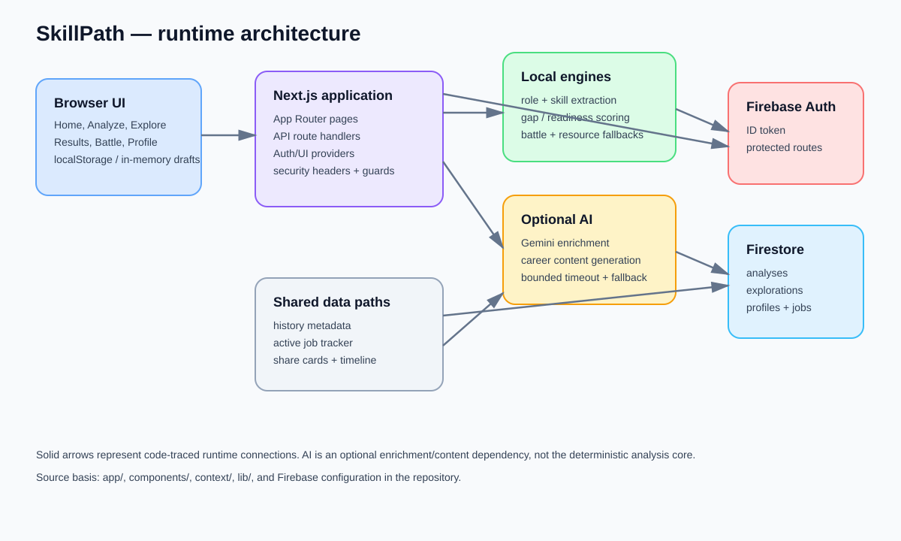
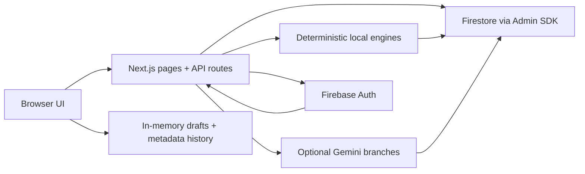
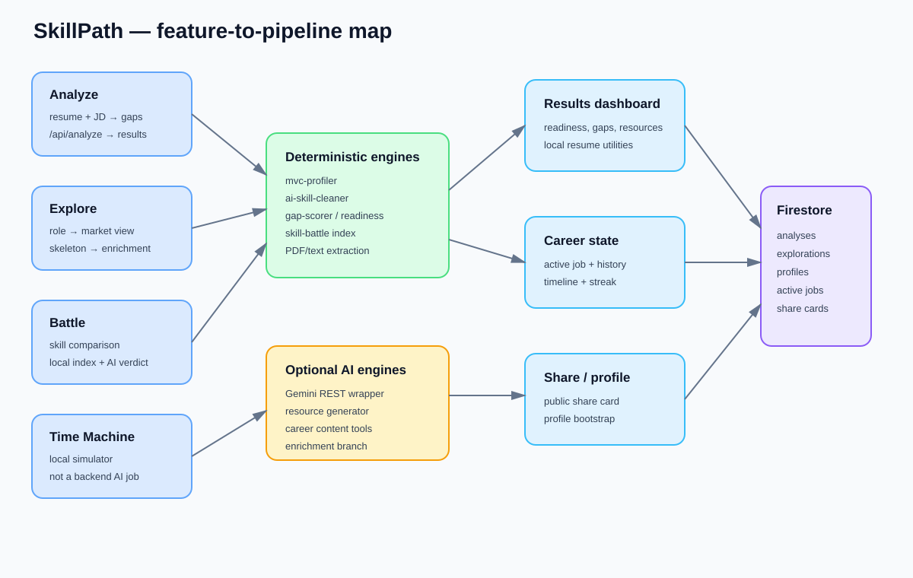
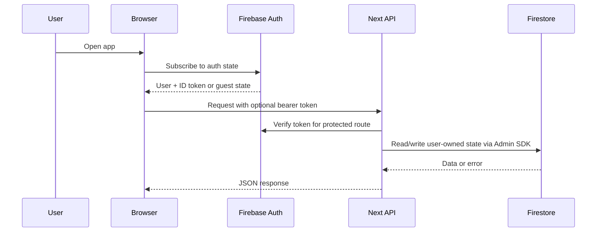
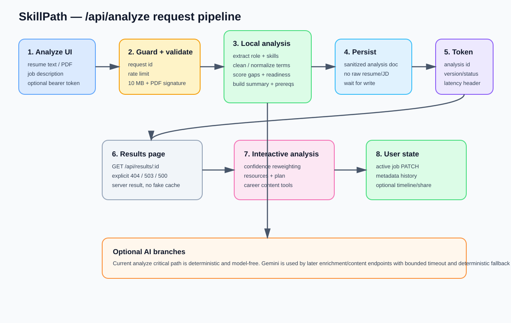
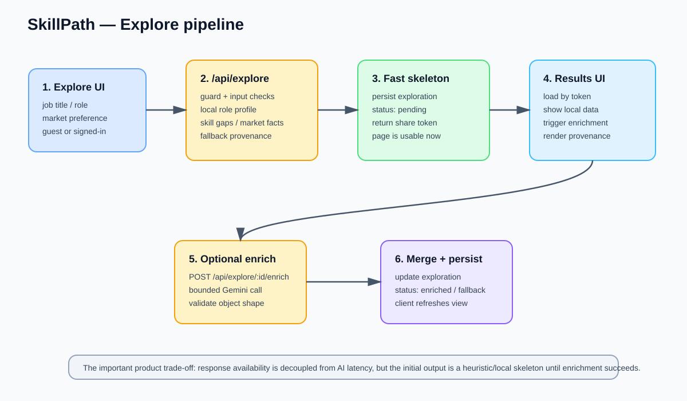
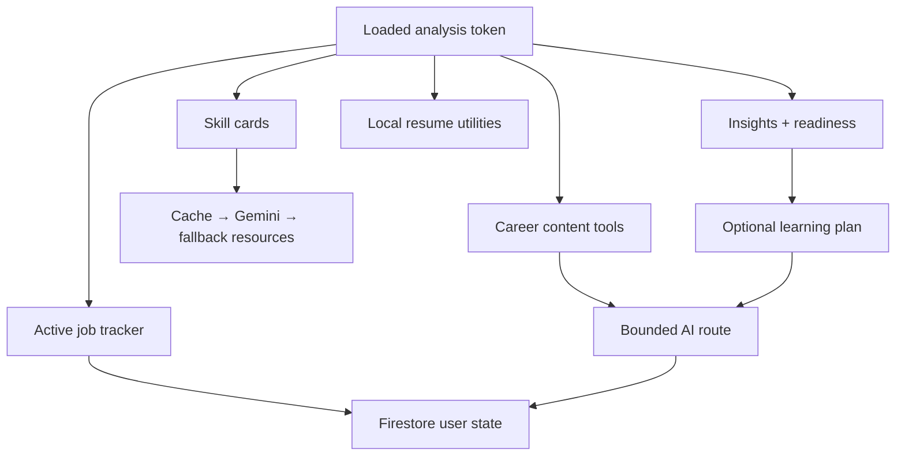
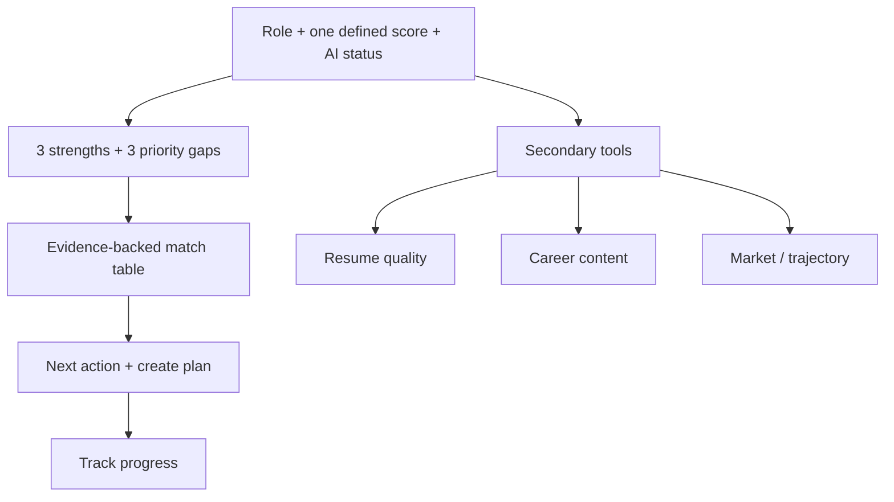

# SkillPath Engineering Audit

**Audit date:** 2026-07-31  
**Scope:** current application source in `app/`, `components/`, `context/`, `lib/`, `prompts/`, `types/`, `scripts/`, configuration, tests, and Firebase rules. Dependencies, `.next/`, and user data folders are excluded from the source graph.  
**Purpose:** explain how every product feature moves through the system, identify the actual runtime pipeline, and compare the current implementation with the pre-fix baseline.

## Executive verdict

SkillPath is a Next.js modular monolith with three kinds of work:

1. **Deterministic local work** — role classification, skill extraction, normalization, gap scoring, readiness, battle aggregation, PDF/text parsing, and many resume utilities.
2. **Optional AI work** — Gemini-backed enrichment, learning plans, resource generation, cover lines, LinkedIn headlines, STAR bullets, and battle verdicts.
3. **Durable user state** — Firebase Authentication and Firestore for analyses, explorations, profiles, active jobs, timelines, streaks, history, and share cards.

The highest-impact pipeline correction is architectural: `/api/analyze` and `/api/explore` no longer require a Gemini response before the user can receive a usable result. Analyze now computes a deterministic result, waits for persistence, and returns a token. Explore returns a persisted local skeleton and can enrich it afterward. This removes external model latency from the critical path, but a new production latency benchmark has not yet been run, so the size of the gain is not proven.

The application now has a safer failure contract for result lookup, persistence, file validation, request IDs, bounded Gemini calls, and raw-input storage. The main remaining risks are distributed rate limiting, incomplete schema validation for model output, a missing active-job archive route referenced by the UI, public-share expiry enforcement, large client bundles, and the lack of a representative accuracy/performance evaluation set.

## Evidence labels

- **EXTRACTED** — directly observed in source, configuration, tests, or command output.
- **INFERRED** — a reasonable interpretation of the extracted control flow; it should be verified with runtime telemetry or an end-to-end test.
- **NOT MEASURED** — no representative benchmark, production trace, model evaluation, or browser performance data was available.

## Scope and methodology

The requested graphify workflow was checked first. The graphify CLI/Python package is not installed in this workspace, and the repository contains more than 200 source/configuration files. Therefore this report uses the graphify fallback approach: deterministic file inventory, route tracing, explicit source references, and diagrams authored from the code. No semantic edge is claimed unless it was visible in the source. The inventory covered **252 files under `app/`, `components/`, `context/`, `lib/`, `prompts/`, and `types/`**, with build output and dependencies excluded.

This report is an engineering audit, not a claim that the product is clinically, financially, or statistically accurate. Skill recommendations, salary/market numbers, readiness scores, and AI-generated career text require a labeled evaluation set before accuracy claims are made.

## System architecture

### Runtime layers

| Layer | Responsibility | Main code locations | Audit status |
|---|---|---|---|
| Browser shell | Navigation, theme, auth state, UI state, preloader, floating actions | `app/layout.tsx`, `context/*.tsx`, `components/ui/*` | **EXTRACTED** |
| Feature pages | User input and feature-specific rendering | `app/*/page.tsx`, `components/*` | **EXTRACTED** |
| API orchestration | Validation, auth, rate limiting, deterministic computation, persistence | `app/api/**/route.ts` | **EXTRACTED** |
| Local intelligence | Parsing, taxonomy, scoring, role profiles, fallback data | `lib/*.ts`, `data/*.json` | **EXTRACTED** |
| AI integration | Bounded Gemini calls and JSON/text parsing | `lib/gemini.ts`, AI API routes | **EXTRACTED** |
| Identity and storage | Firebase client auth, Admin SDK, Firestore rules | `lib/firebase.ts`, `lib/firebase-admin.ts`, `firestore.rules` | **EXTRACTED** |
| Observability | Request IDs and latency headers on selected routes | `lib/request-guard.ts`, analyze/explore APIs | Partial; **NOT MEASURED** end-to-end |

## End-to-end feature map

| Feature | Entry point | Main pipeline | Persistence | AI dependency | Current status |
|---|---|---|---|---|---|
| Home / landing | `/` | marketing sections → Analyze / Explore CTAs | none | none | Implemented; unsupported performance/accuracy claims were removed |
| Analyze resume | `/analyze` | multipart input → validation → local extraction/scoring → sanitized Firestore doc → result token | `analyses/{id}` | No AI on critical path | Implemented and deterministic-first |
| Results dashboard | `/results/[id]` | result token → API read → insight cards → optional actions | analysis + active job + metadata history | Plan, resources, career text | Implemented; server result is authoritative |
| Explore role | `/explore` | role input → local skeleton → persisted token → client enrichment | `explorations/{id}` | Optional enrichment | Implemented as two-stage pipeline |
| Shared Explore result | `/explore/[share_token]` | server Admin SDK read → initial data → client UI | exploration document | Existing enrichment only | Implemented; access/expiry policy needs explicit review |
| Skill Battle | `/battle` | skill input → local index/estimate → optional AI verdict | no primary result write | Estimate/verdict routes | Implemented; estimate is a normalized model estimate, not a survey |
| Time Machine | `/time-machine` | browser upload/questions → local timeout → heuristic simulation | none | No API/AI call | Implemented simulation; marketing must not present it as a live AI analysis |
| Sign-in | `/auth` | Firebase client auth → token provider → profile | Firebase Auth + profile | none | Implemented |
| Profile | `/profile` | bearer token → profile/active-job/timeline reads | profiles, active jobs, timeline | none | Implemented |
| History | `/history` | local metadata read → route to result/explore token | browser localStorage only | none | Implemented; raw resume/JD is not stored |
| Active job tracker | Results/profile UI | optimistic PATCH → authenticated Firestore update | active jobs + archived jobs | none | Mostly implemented; archive endpoint reference is unresolved |
| Profile share | Profile action → `/api/profile/share` | authenticated share-card creation → public share page | `share_cards/{id}` | none | Implemented; expiry enforcement needs review |
| Streak/timeline | Profile actions | authenticated increment/create event | profiles + timeline | none | Implemented |
| Learning plan | Results action | token + bearer → analysis read → Gemini JSON → update | analysis document | Yes, bounded/fallback | Implemented; output schema is only lightly validated |
| Resource generation | Results skill cards | skill input → cache lookup → Gemini/fallback → cards | `resource_cache` and UI | Optional | Implemented; generated content needs provenance/quality evaluation |
| Resume career content | Results modals | text/skill context → guarded AI route → JSON/text fallback | usually client-only | Optional | Implemented with fallback metadata on most routes |
| Resume audit utilities | Results cards | client-side deterministic text analysis | none | none | Implemented; heuristic, not ATS vendor equivalence |

## Primary request flows

### 1. Global shell and authentication

`app/layout.tsx` mounts the application-wide providers and shell. The active order is:

`ThemeProvider` → `AuthProvider` → `DraftProvider` → `UIProvider` → transition/preloader/app shell components.

`AuthContext` listens to Firebase `onAuthStateChanged` and exposes the current user plus an ID-token helper. Protected API calls send `Authorization: Bearer <Firebase ID token>`. The UI can continue as a guest for features that explicitly support guest access; authenticated routes verify the token server-side.

`DraftContext` holds the current resume/JD draft in memory. `history.ts` stores only result metadata and tokens in browser storage. This separates the user’s raw resume/JD from browser persistence.

### 2. Analyze pipeline

**Source path:** `app/analyze/page.tsx` → `app/api/analyze/route.ts` → `lib/pdf-extract.ts`, `lib/mvc-profiler.ts`, `lib/ai-skill-cleaner.ts`, `lib/gap-scorer.ts`, `lib/readiness.ts`, Firebase Admin.

1. The Analyze page collects a job description and either resume text or a PDF.
2. The browser sends multipart form data to `/api/analyze`, optionally with a Firebase bearer token.
3. The route creates a request ID and applies the request guard/rate limit.
4. The route enforces a 10 MB upload limit and validates PDF MIME/signature when a PDF is supplied.
5. PDF text is extracted locally. Text input remains in the server request only for computation.
6. Local role classification and skill extraction run through the MVC profile/taxonomy data.
7. The skill cleaner normalizes aliases/noise, then gap scoring and readiness utilities derive the user-facing analysis.
8. The API constructs a sanitized analysis document. The current implementation does not persist raw `resume_text` or `jd_text` in the analysis document.
9. Firestore persistence is awaited. A failed write returns an explicit persistence error instead of issuing an unusable token.
10. The response returns the analysis token/id plus analysis version, enrichment status, summary source, request ID, and pipeline latency headers.
11. The Analyze page saves metadata to local history and navigates to `/results/{token}?new=true`.
12. The Results page fetches `/api/results/{id}`. Unknown IDs return 404; Firebase unavailability is distinct from a missing result.

**Critical-path behavior:** The current Analyze request is deterministic and model-free. This is **EXTRACTED** from the route implementation. Whether it is below a particular latency target is **NOT MEASURED** after the change.

### 3. Explore pipeline

**Source path:** `app/explore/page.tsx` → `app/api/explore/route.ts` → `app/explore/[share_token]/page.tsx` → `app/api/explore/[id]/enrich/route.ts` → `components/explore/ExploreResultsClient.tsx`.

1. The user submits a role title and market context from the Explore page.
2. `/api/explore` validates the input, applies the request guard/rate limit, and computes a local role skeleton.
3. The local skeleton includes role/skill/market fields and explicit provenance/fallback metadata.
4. The skeleton is persisted before the API returns. The document starts with `enrichment_status: "pending"`.
5. The client renders the result immediately using the token.
6. `ExploreResultsClient` triggers `/api/explore/{id}/enrich` when enrichment is pending.
7. The enrichment route makes a bounded Gemini request, validates the broad object shape, merges usable fields, and persists `enriched` or `fallback` status.
8. The client refreshes or updates the displayed result.

This gives the feature availability independent of AI availability, but the first result is intentionally a local heuristic skeleton. That product trade-off is **INFERRED** from the two-stage design and should be reflected in UI copy.

### 4. Results dashboard and downstream actions

After the result document is loaded, the dashboard fans out into independent feature branches:

- **Readiness and confidence:** `AnalysisInsights`, `ReadinessRing`, `ConfidenceStrip`, `SelfAssessmentModal`, and `SkillConfidenceHeatMap` display or adjust local analysis signals.
- **Skill cards:** `SkillCard`, `ResourceCard`, and `GenerateAllButton` call `/api/generate-resources`. Resource generation uses cache → Gemini → curated fallback behavior.
- **Learning plan:** `/api/results/[id]/plan` authenticates the user, loads the analysis, requests a JSON plan, and updates the analysis document.
- **Job tracking:** `PinJobButton` and `ActiveJobCard` call `/api/active-job` for authenticated state changes. UI updates are optimistic, then synchronized to Firestore.
- **Career content:** STAR bullets, cover lines, LinkedIn headlines, and other result actions call separate guarded AI routes. Deterministic fallback text is returned when AI is unavailable on the routes that implement fallback metadata.
- **Resume utilities:** ATS audit, buzzword eraser, quantification scan, and keyword density run locally in the browser. They do not represent a vendor’s proprietary ATS score.
- **Derived visual modules:** competitive benchmark, salary ROI, company alignment, role pivot, career compass, and time-machine-style views are derived from local data/heuristics. Accuracy and calibration are **NOT MEASURED**.

### 5. Skill Battle

**Source path:** `app/battle/page.tsx` → `components/SkillBattle.tsx` → `app/api/battle/estimate/route.ts`, `app/api/battle/ai/route.ts`, `lib/skill-battle.ts`.

1. The browser collects two skills or career choices.
2. The local battle index is built from the skill data and aggregates votes, premium, trend, and related signals in memory.
3. `/api/battle/estimate` can return a normalized estimate with a deterministic 54/46-style fallback. The current copy no longer presents the result as a real survey.
4. `/api/battle/ai` can request a one-sentence Gemini verdict and returns a fallback verdict on error.

The local index makes repeated comparisons cheap. The estimate is a model output, not a statistically sampled market survey; no calibration set or confidence interval is currently available.

### 6. Time Machine

**Source path:** `app/time-machine/page.tsx` → `components/ResumeTimeMachine.tsx`.

This feature is browser-local. It reads uploaded/text resume input, asks for role/salary/location/seniority questions, waits about 1.4 seconds to simulate processing, and applies substring rules plus hard-coded gap/premium heuristics. It does **not** call `/api/analyze`, Gemini, or Firestore. It is therefore a simulator/prototype pipeline, not a backend AI analysis job. The UI should continue to label it as simulation unless it is connected to a real analysis service.

## API inventory

| Route | Method | Purpose | Auth | External dependency | Failure contract |
|---|---|---|---|---|---|
| `/api/analyze` | POST | Parse resume/JD, compute analysis, persist token | Optional | None on critical path | 4xx validation; 503 persistence; request/latency metadata |
| `/api/results/[id]` | GET | Read an analysis by token | Optional | Firestore | 404 unknown; 503 Firebase unavailable; sanitized response |
| `/api/results/[id]/plan` | POST | Generate/update learning plan | Required | Gemini | Guarded request; model/fallback error contract |
| `/api/explore` | POST | Create local role skeleton | Optional | Firestore | Validation, rate limit, explicit persistence errors |
| `/api/explore/[id]` | GET | Read exploration result | Optional/public token flow | Firestore | 404 missing |
| `/api/explore/[id]/enrich` | POST | Add optional role enrichment | Optional | Gemini + Firestore | Bounded call; fallback/502 behavior |
| `/api/generate-resources` | POST | Generate skill resources | Optional | Firestore cache + Gemini | Cached/AI/curated fallback |
| `/api/generate-star-bullets` | POST | Generate STAR bullets | Optional | Gemini | Rate limited; placeholder-safe fallback |
| `/api/generate-cover-lines` | POST | Generate cover-letter lines | Optional | Gemini | Guarded; deterministic fallback |
| `/api/generate-linkedin-headlines` | POST | Generate LinkedIn headlines | Optional | Gemini | Guarded; deterministic fallback |
| `/api/battle/estimate` | POST | Return skill comparison estimate | Guest/auth | Gemini optional | Normalized fallback; not survey data |
| `/api/battle/ai` | POST | Return AI battle verdict | Guest/auth | Gemini | Fallback verdict; guard consistency needs improvement |
| `/api/active-job` | GET/POST/PATCH | Read/create/update active job | GET optional; writes required | Firestore | Auth/validation/transaction errors |
| `/api/active-job/history` | GET | Read archived jobs | Required | Firestore | Auth + query errors |
| `/api/profile` | GET/PATCH | Bootstrap/read/update profile | Required | Firestore | Auth + validation errors |
| `/api/profile/share` | POST | Create public share card | Required | Firestore | Auth + persistence errors |
| `/api/profile/streak` | POST | Increment daily streak | Required | Firestore | Auth + transaction errors |
| `/api/profile/timeline` | GET/POST | Read/create timeline events | Required | Firestore | Auth + validation errors |

### Active-job archive review

The UI reference to `/api/active-job/archive` is backed by `app/api/active-job/archive/route.ts`, so the endpoint exists. The implementation is authenticated and returns explicit database/empty-job errors. Its remaining risk is atomicity: it reads the active job, writes the archive document, and then deletes the active document as separate operations. A retry or concurrent archive can therefore duplicate or partially complete the operation. Make the archive write/delete a Firestore transaction or add an idempotency key.

## Data and storage flow

| Data | Browser storage | Firestore | Notes |
|---|---|---|---|
| Raw resume/JD draft | In-memory `DraftContext` | Not written by Analyze document | Better privacy boundary; memory is lost on refresh |
| Analysis metadata | LocalStorage history | `analyses/{id}` | History stores token/display metadata, not raw input |
| Analysis result | No authoritative session cache | `analyses/{id}` | Results API is source of truth |
| Explore result | Client state/history metadata | `explorations/{id}` | Local skeleton then enrichment update |
| Auth identity | Firebase Auth client session | Firebase Auth | API verifies bearer token where required |
| Profile | UI state | `profiles/{uid}` | Admin SDK writes bypass client rules |
| Active job | UI optimistic state | active job and archive collections | Authenticated writes |
| Resource cache | UI request state | `resource_cache` | Direct client reads/writes are disabled in rules |
| Public share | URL token | `share_cards/{id}` | Expiration is written; enforcement must be confirmed |
| Preloader flag | sessionStorage | none | Small UI-only state |
| Market/currency preference | localStorage | none | Small UI-only state |

`firestore.rules` disables direct client reads for analyses, explorations, and resource cache. Server API routes use the Admin SDK, so server-side ownership checks remain important. Rule protection is not a substitute for API authorization.

## Intelligence and scoring pipeline

### Deterministic engines

| Engine | What it does | Main limitation |
|---|---|---|
| `lib/pdf-extract.ts` | Extracts text from PDF input, with raw-text fallback | PDF layout/scan quality can reduce extraction quality; no OCR pipeline was found |
| `lib/mvc-profiler.ts` | Maps role text to role profiles, standard skills, trends, and trajectory | Ordered substring/fuzzy matching can misclassify ambiguous titles |
| `lib/ai-skill-cleaner.ts` | Normalizes aliases and filters noise with local taxonomy/fuzzy matching | Taxonomy coverage and false-positive rate are not benchmarked |
| `lib/gap-scorer.ts` | Derives skill gaps from extracted resume/JD signals | Scores are product heuristics, not a validated competency test |
| `lib/readiness.ts` | Converts gaps and signals into readiness/countdown views | No calibration or outcome validation |
| `lib/skill-battle.ts` | Aggregates local skill index signals for battle comparisons | Market representation and sampling provenance are limited |
| `lib/company-detector.ts` | Detects company type/category locally | Heuristic; ambiguity handling is not externally validated |
| `lib/history.ts` | Stores capped local result metadata | Browser-local history does not synchronize across devices |

### AI engine

`lib/gemini.ts` calls a configured primary model and up to one configured fallback, with an 8-second timeout and bounded attempts. JSON calls strip code fences and parse JSON. The routes add deterministic fallbacks where implemented.

The main remaining quality gap is schema validation. JSON parsing confirms that a response is syntactically JSON; it does not guarantee required fields, ranges, cardinality, or safe content. Add route-specific schemas (for example with Zod or equivalent), reject/repair malformed output, and record model/version/prompt metadata for reproducibility.

## Security, reliability, and correctness

### Improvements already present

- Unknown result IDs now return 404 rather than a fake or sample result.
- Raw resume and job-description payloads are not persisted in the analysis document.
- Draft payloads are held in memory instead of sessionStorage.
- Analyze validates upload size and PDF signature.
- Key AI routes have request IDs, rate-limit guards, bounded timeouts, and deterministic fallback metadata.
- Gemini is no longer on the Analyze critical path.
- Analyze waits for Firestore persistence and reports persistence failure explicitly.
- Security headers and a report-only CSP are configured in `next.config.ts`.
- Firestore client direct reads for sensitive analysis/exploration/cache collections are disabled.
- User-facing unsupported claims such as `<1s`, `99.4% accuracy`, and fake survey language were removed or qualified.
- Generated `.next` files are ignored by ESLint configuration, so the lint command no longer fails because of build output.

### Remaining risks

1. **Rate limiting is process-local.** `middleware.ts` and route guards use in-memory maps. Multiple server instances will not share limits. Replace with a distributed limiter (for example Redis/Upstash or a provider-native edge limit) before relying on it for abuse prevention.
2. **Duplicate rate-limit paths exist.** Middleware and route-level guards can apply different identity and limit logic. Consolidate policy and publish the intended limits.
3. **`/api/battle/ai` is inconsistent with the other AI routes.** It still uses a separate guest limiter and its fallback response does not expose the same explicit fallback/provenance contract.
4. **Model output validation is broad.** Add strict schemas, length limits, allowed enums, and prompt/model version tracking.
5. **Public share expiry needs enforcement.** Share-card creation writes an expiration date, but the public server page must explicitly reject expired cards. A stored `expires_at` field alone is not enforcement.
6. **Share-token access needs a threat model.** Public tokens should be unguessable, scoped to intentionally public fields, revocable, and protected from accidental sensitive profile leakage.
7. **Active-job archive is not atomic.** Convert the archive write/delete sequence into a transaction or make it idempotent.
8. **No idempotency key for expensive writes.** Retries can create duplicate analyses/explorations or duplicate timeline events. Add idempotency for creation endpoints.
9. **No queue/outbox for enrichment.** Client-triggered enrichment is acceptable for a prototype, but a durable job/outbox is more reliable for retries, multi-instance operation, and observability.
10. **No E2E authorization matrix.** Add tests for guest/authenticated/unauthorized/expired/missing-resource paths.

## Performance and operational audit

### Measured baseline vs current state

The previous engineering audit recorded the baseline timings below. The current code was rebuilt and statically verified, but no representative post-change HTTP benchmark or browser trace was run during this audit.

| Area | Before baseline | Current implementation | Gain / interpretation |
|---|---:|---|---|
| `/api/analyze` | 2.31–6.59 s measured | Deterministic local critical path; optional AI moved out | The external-model wait was removed from the critical path; post-change latency is **NOT MEASURED** |
| `/api/explore` | 10.63–18.65 s measured | Local skeleton persisted first; enrichment is separate | Removes synchronous large-model dependency by design; post-change latency is **NOT MEASURED** |
| Firestore save | Fire-and-forget risk | Awaited write + explicit persistence failure | Correctness gain: no token is issued for an unconfirmed save |
| Missing result | Could fall through to fake/sample behavior | Explicit 404 except deliberate `sample` token | Correctness/privacy gain; no numeric benchmark needed |
| Raw browser payload | Full analysis/explore payload could be stored | Drafts in memory; history metadata only | Reduced persistence exposure; payload-size reduction **NOT MEASURED** |
| Lint | Full lint failed on generated `.next` files | Passes with 0 errors; 268 warnings remain | CI usability gain: command now completes |
| Production build | 36.5 s baseline | About 35 s in the latest local run | ~4% faster in this run, but environment variance means this is **NOT a stable benchmark** |
| Shared first-load JS | 339 kB baseline | 340 kB latest build | ~0.3% larger; no bundle-size gain yet |
| New contract tests | None in baseline | 5/5 passing | Added regression coverage for high-risk behavior |
| Dependency audit | Baseline had unresolved findings | 3 high, 0 critical, 0 moderate/low after current install | Still not clean; remaining highs are nested Next `postcss`/`sharp` nodes and require dependency-tree resolution |

### Current build output snapshot

The latest successful build reported approximately:

- Shared First Load JS: **340 kB**.
- `/auth`: **744 kB**.
- `/battle`: **716 kB**.
- `/results/[id]`: **507 kB** after the Skill Card–first restructure.
- `/analyze`: **495 kB**.
- `/explore/[share_token]`: **494 kB**.
- `/explore`: **401 kB**.

Explore and Battle each mount a particle background with `particleCount: 1500`. Global providers and feature components also contribute to route cost. Browser FPS, LCP, INP, memory, and mobile-device behavior are **NOT MEASURED**. The highest practical performance opportunity is route-level lazy loading and reducing shared shell work.

## Verification performed

| Check | Result |
|---|---|
| `npm test` | Pass: 5/5 contract tests |
| `npx tsc --noEmit` | Pass |
| `npm run lint -- --quiet` | Pass: 0 errors |
| Full `npm run lint` | Pass: 0 errors, 268 warnings |
| `npm run build` | Pass with Next 15.5.22 |
| `git diff --check` | Pass; only repository line-ending warnings |
| `npm audit --omit=dev --json` | 3 high, 0 critical; not fully clean |

These checks prove build/type/lint/contract integrity in the current environment. They do not prove production latency, browser performance, model accuracy, or distributed-system behavior.

## Before-and-after comparison

### What materially improved

| Dimension | Before | After | Practical value |
|---|---|---|---|
| Analyze availability | Depended on synchronous Gemini work | Local deterministic result can be produced without Gemini | Better resilience and likely lower tail latency |
| Explore availability | Waited for a large AI response | Usable local skeleton first, optional enrichment second | User can see a result while AI is unavailable/slow |
| Persistence correctness | Save could be invisible to the caller | Save is awaited and failure is explicit | Prevents unusable result links |
| Result integrity | Unknown IDs could produce misleading fallback behavior | Unknown IDs are explicit 404s | Safer UX and less data confusion |
| Input privacy | Larger raw payloads could be placed in browser storage | Drafts are in memory; history is metadata | Smaller exposure surface |
| Validation | AI/PDF boundary had weaker controls | Upload size/signature checks and route guards | Better abuse/failure handling |
| Build hygiene | Generated files broke lint | Generated files are ignored | Cleaner CI signal |
| Regression protection | No targeted contract suite | 5 high-risk contract tests | Easier future refactoring |

### What did not improve yet

- Shared JavaScript did not shrink: 339 kB → 340 kB in the observed builds.
- Route bundle sizes remain large, especially `/auth`, `/battle`, and `/results/[id]`.
- Full lint still has 268 warnings; warnings should be reduced before treating lint as a quality gate.
- Dependency audit still reports three high findings.
- No numerical accuracy gain can be claimed because there is no labeled evaluation set.
- No post-change latency gain can be claimed until the same benchmark is run against the same deployment shape.
- Distributed rate limiting, idempotency, queues, and production telemetry are not implemented.

### Recommended measurement plan

Run the same controlled test before and after each pipeline release:

1. Use fixed small/medium/large resume and JD fixtures, including malformed PDF, scanned PDF, empty input, and ambiguous role titles.
2. Measure p50/p95/p99 latency for `/api/analyze`, `/api/explore`, result reads, enrichment, and resource generation.
3. Measure success rate, persistence failure rate, timeout rate, fallback rate, and duplicate creation rate.
4. Capture browser LCP/INP/CLS, JS transfer, route hydration time, and particle FPS on a mid-range mobile profile.
5. Build a labeled set for role classification, skill extraction, gap ranking, and generated-content factuality.
6. Store model name, prompt version, data version, request ID, and fallback status with each evaluated run.

## Priority roadmap

### P0 — correctness and security

1. Make `/api/active-job/archive` atomic/idempotent.
2. Enforce `expires_at` on public share reads and test expired/revoked links.
3. Add strict schemas and output limits to every Gemini JSON route.
4. Replace process-local rate limits with a distributed limiter; remove duplicate policy paths.
5. Add E2E tests for auth, ownership, missing IDs, Firebase outage, malformed uploads, expired shares, and AI fallback.
6. Resolve the remaining high dependency findings using a verified dependency tree and repeat `npm audit`.

### P1 — measurable product quality

1. Add route-level lazy loading for heavy result, battle, chart, and particle components.
2. Add server metrics and browser performance telemetry with request IDs.
3. Add idempotency keys for Analyze, Explore, timeline, and share creation.
4. Create a versioned evaluation set and report precision/recall or task-specific quality metrics.
5. Add provenance labels to salary, trend, benchmark, and market estimates.

### P2 — scale and maintainability

1. Move PDF parsing and AI enrichment to a durable worker/queue.
2. Add an outbox/job status model for retries and progress updates.
3. Store evidence spans for extracted skills so users can inspect why a skill was detected.
4. Separate deterministic taxonomy/scoring packages from HTTP route orchestration.
5. Add a release report covering code version, data version, model version, benchmark results, and known limitations.

## Traceability: important source files

- Application shell: `app/layout.tsx`, `context/AuthContext.tsx`, `context/DraftContext.tsx`, `context/UIContext.tsx`.
- Analyze: `app/analyze/page.tsx`, `app/api/analyze/route.ts`.
- Results: `app/results/[id]/page.tsx`, `app/api/results/[id]/route.ts`, `app/api/results/[id]/plan/route.ts`.
- Explore: `app/explore/page.tsx`, `app/api/explore/route.ts`, `app/api/explore/[id]/route.ts`, `app/api/explore/[id]/enrich/route.ts`, `components/explore/ExploreResultsClient.tsx`.
- Battle: `app/battle/page.tsx`, `components/SkillBattle.tsx`, `app/api/battle/estimate/route.ts`, `app/api/battle/ai/route.ts`, `lib/skill-battle.ts`.
- Local intelligence: `lib/mvc-profiler.ts`, `lib/ai-skill-cleaner.ts`, `lib/gap-scorer.ts`, `lib/readiness.ts`, `lib/pdf-extract.ts`, `lib/company-detector.ts`.
- AI and resources: `lib/gemini.ts`, `lib/resource-generator.ts`, `app/api/generate-resources/route.ts`.
- User state: `app/api/active-job/route.ts`, `app/api/active-job/history/route.ts`, `app/api/profile/route.ts`, `app/api/profile/share/route.ts`, `app/api/profile/streak/route.ts`, `app/api/profile/timeline/route.ts`.
- Security/configuration: `lib/request-guard.ts`, `lib/rate-limit.ts`, `middleware.ts`, `next.config.ts`, `firestore.rules`, `eslint.config.mjs`.
- Regression tests: `tests/engineering-contract.test.mjs`.

## Final assessment

The current pipeline is a stronger and more honest modular monolith: deterministic analysis is available without a model round trip, Explore is staged, persistence is explicit, raw input is not persisted in the normal analysis document, result lookup no longer fabricates data, and the build/test checks are healthier.

The next “best solution” is not to add more AI calls to the request path. It is to finish the correctness/security P0 items, measure the real post-change gains, reduce bundle cost, and introduce a versioned evaluation/observability layer. Only after those measurements should the product publish numerical claims about speed, accuracy, salary outcomes, or market confidence.

## Pipeline implementation update — AI evidence enrichment

The current code now implements the low-latency version of the recommended pipeline:

1. `/api/analyze` performs the local deterministic analysis and persists the first result.
2. If `GEMINI_API_KEY` and `ANALYZE_ENCRYPTION_KEY` are configured, the request stores the resume/JD in a separate AES-256-GCM encrypted Firestore document with a 30-minute expiry. It is not included in the public analysis response and is deleted after enrichment.
3. The Results page displays the local result first and triggers `/api/analyze/[id]/enrich` in the background.
4. The enrichment route obtains a Firestore transaction lock so duplicate browser requests do not run the AI pipeline concurrently.
5. Gemini extracts role, resume evidence, and job requirements using bounded structured JSON output.
6. Runtime validation bounds every field and verifies that evidence quotes appear in the original source text.
7. Exact, alias, and token matches run locally first. Only unresolved requirements use one bounded Gemini embedding batch. If embeddings fail, the deterministic local match remains valid.
8. Deterministic coverage scoring calculates the new gap score. Gemini does not directly control the final score.
9. A second grounded Gemini call creates the explanation from the validated evidence/match JSON only. Evidence and requirement IDs are checked before persistence.
10. If any AI step fails, the local result remains available and is marked `fallback` rather than being replaced by invented output.

New implementation files include `lib/ai-analysis-schema.ts`, `lib/ai-evidence-extractor.ts`, `lib/analyze-enrichment-store.ts`, `lib/semantic-skill-matcher.ts`, and `app/api/analyze/[id]/enrich/route.ts`.

The default first-response path remains model-free. The only added first-response cost when enrichment is enabled is the encrypted temporary-payload write, executed in parallel with the analysis write. AI latency is moved behind the Results page and is not allowed to block the first result.

## Deep Results-page audit

**Audited source before restructuring:** `app/results/[id]/page.tsx` (854 lines). Current page: 546 lines. The audit also covered components imported from `components/results/` and `components/analyze/AtsAuditorCard.tsx`.

### What the page currently contains

| Area | Current contents | Value | Problem |
|---|---|---|---|
| Header | Job-ready message, weeks, gap count, date, Save, Pin, Share | Strong orientation and primary actions | Uses heuristic weeks/date and can overstate certainty |
| Gaps tab | Salary ROI, confidence heat map, time-to-ready, score, MVC skills, gap list, resources, roadmap | Contains the user’s main next actions | Six representations of the same readiness/gap problem create repetition |
| Skill cards | Priority, weeks, reason, confidence, tracking, curriculum, resources, STAR bullets | High practical value when accurate | Each card has too many actions; evidence is not currently visible |
| Roadmap | AI-generated weekly learning plan | Useful when the user explicitly asks for a plan | It competes with the gap list and is hidden behind a separate action |
| Insights tab | ATS, buzzword, quantification, keyword density, company alignment, freshness, role switching, cover-letter tool, skill list | Useful as secondary resume workbench | Too many cards; several depend on raw text that the Results API removes |
| Trajectory tab | Time Machine, benchmark, LinkedIn, foundational pillars, analysis insights, salary jump | Good for exploration after the immediate plan | Mixes actionable analysis with speculative simulations and duplicates score/gap information |

### Good content to keep in the primary experience

- One clearly named match/readiness score with a visible definition.
- The top three gaps, ordered by must-have importance and evidence confidence.
- A short explanation of why each gap was detected, with a resume/JD evidence quote.
- The next action for each top gap.
- A single “Create learning plan” action.
- Confidence self-assessment, but only once rather than in the modal and every card simultaneously.
- Pin/save/share actions.
- AI enrichment status and provenance: local, AI-enriched, or fallback.

### Content that is extra, duplicated, or should be secondary

| Content | Recommendation | Reason |
|---|---|---|
| Salary ROI card | Move to optional “Market context” section | It does not help the immediate user decision and depends on estimates |
| Skill confidence heat map | Keep only if it replaces per-card confidence controls | Current UI duplicates confidence controls in the onboarding modal and every skill card |
| Time-to-ready estimator | Merge into the main score card | It repeats gap count, critical count, hours, and weeks |
| MVC essentials list | Collapse into “Why these gaps matter” | It repeats the gap list and can be a long wall of chips |
| Generate All resources | Keep as secondary action | Generating one AI response per gap is slow and can create unnecessary content |
| STAR bullets | Move into a single skill action menu | Repeating the button under every card adds visual noise |
| ATS / buzzword / quantification / keyword cards | Combine into one Resume Quality panel | These are all resume-improvement checks, not separate primary decisions |
| Resume Skills Breakdown | Remove or show inside the evidence panel | It duplicates extracted skills and does not show why they matter |
| Company Alignment Matrix | Keep behind “More analysis” | Useful but not part of the first decision path |
| Freshness Score | Keep only when source data is clearly labeled | “Freshness” is a heuristic and can be misread as hiring-market truth |
| Role Switch Panel | Keep as optional exploration | It is not needed to close the current job gap |
| Resume Time Machine | Move to a separate simulator route or label strongly as simulation | It uses a hard-coded base salary and heuristic projections |
| Competitive Benchmark Score | Remove or merge with the main score | It is a second score built from the first score and heuristic penalties |
| LinkedIn headline optimizer | Move to a “Career content” toolbox | Useful, but unrelated to the immediate skill-gap decision |
| Foundational Pillars + Analysis Insights | Merge into one compact explanation | Both summarize gaps, effort, readiness, and priorities |
| Salary-jump banner | Hide until data provenance exists | A precise salary jump can look like a promise |

### Correctness issues found on the Results page

1. **Resume audit inputs are empty in normal server results.** `app/api/results/[id]/route.ts` removes `resume_text` and `jd_text`, while the Results page passes `data.resume_text || ''` into `AtsAuditorCard`, `BuzzwordEraserCard`, `QuantificationScanner`, `KeywordDensityChecker`, and `CompanyAlignmentMatrix`. These cards therefore cannot produce meaningful results after a normal page load.
2. **Score meaning is inconsistent.** `gap_score` is presented as “resume match” in one place, “job-ready” in the header, and is replaced by an active-job readiness score when a job is pinned. The UI needs separate labels for `match_score` and `readiness_score`, or one explicitly defined score.
3. **The header date is recomputed from `new Date()` and `remainingWeeks`.** It can disagree with the server’s `ready_by_date`, especially after AI enrichment or confidence changes.
4. **Critical count uses `in_mvc`, not requirement importance.** The new AI pipeline has `must_have`, `should_have`, and `nice_to_have`; the UI should use those fields instead of assuming every MVC item is a critical requirement.
5. **Confidence assessment is client-only in this page.** The UI recomputes readiness locally, but the assessment is not visibly persisted in the Results-page flow, so refresh/device changes can lose the user’s correction.
6. **The active-job update is optimistic without visible rollback.** A failed PATCH can leave the visual tracker out of sync with Firestore.
7. **The plan expansion state has a setter but no visible control.** `isPlanExpanded` affects the rendered list, but the page does not expose a clear “show all weeks” action.
8. **Missing-result retries are too aggressive.** A 404 is retried before displaying the error, adding delay to invalid/expired links without improving recovery.
9. **The page imports unused components/icons.** `CareerCompass`, `ConfidenceStrip`, several icons, and other imports create maintenance noise and make the page harder to reason about.

### Recommended simplified Results information architecture

Recommended primary order:

1. **Header:** target role, score definition, enrichment status, Save/Pin/Share.
2. **Decision summary:** top three strengths, top three gaps, confidence, and one grounded paragraph.
3. **Evidence table:** requirement, status (`matched`, `partial`, `transferable`, `missing`), supporting quote, and confidence.
4. **Action plan:** top three gaps with one next action and a single learning-plan button.
5. **Progress:** optional confidence assessment and active-job tracking.
6. **Secondary toolbox:** resume checks, content generators, market context, and simulations in collapsed panels or separate routes.

This reduces the first decision path from many independent cards to one score → evidence → action loop. It also gives the new AI pipeline a visible purpose: users can inspect why the system classified a skill as matched or missing.

### Results-page implementation priority

- **P0:** stop rendering raw-text audit cards with empty inputs; replace them with server-computed sanitized findings or hide them until inputs are available.
- **P0:** define and rename score semantics so “match” and “readiness” cannot be confused.
- **P0:** display AI evidence/status and quote-backed reasons in the top gap cards.
- **P1:** merge duplicate score/time/heat-map/insight cards into one summary module.
- **P1:** move resume, career-content, market, and simulation tools into secondary panels/routes.
- **P1:** continue reducing the initial bundle; lazy-loading secondary components reduced the route from about 601 kB to **507 kB First Load JS** in the latest build.
- **P2:** persist confidence assessments and active-job changes with rollback/error state.

The safest next UI change is therefore a content reduction and correctness pass, not another visual decoration pass. The page should show fewer claims, but every displayed claim should have a source, definition, or explicit “estimate” label.

## Results-page implementation update

The approved Skill Card–first structure is now implemented:

| Before | After |
|---|---|
| 854-line page with three large tabs and many primary cards | 546-line single decision flow with a shorter initial viewport |
| Salary, heat map, time estimator, gaps, roadmap, ATS, trajectory, and simulations all competed for attention | Role summary → evidence-backed priority Skill Cards → roadmap → progress |
| Skill cards showed generic reasons | Skill cards now show AI match status, confidence, and verified evidence quotes when enrichment completes |
| Resume audit cards rendered with `data.resume_text`, which the API strips | Raw-text audit cards no longer render misleading empty results; the optional Resume Quality panel explains the privacy boundary |
| Secondary career/market tools were always part of the page tree | Career content and market/trajectory tools are lazy-loaded behind “More tools” at the bottom of the Results page |
| `gap_score` appeared under the ambiguous “Match score” label | The top summary explicitly labels it “Gap score” and explains that a higher score means stronger coverage |
| Missing result requests retried 404s | Results page retries only transient 5xx responses |
| Plan weeks had no visible expand control | Roadmap shows four weeks first and exposes “Show all” when more exist |
| Top scores had no requirement breakdown | Compact summary shows checked, matched, partial, transferable, missing, and review counts |
| Skill cards showed evidence without deeper source context | Cards now expose collapsed evidence metadata for section, recency, years, strength, and quote |
| Gap cards did not give a concrete proof step | Every card shows a concise “Next proof” action; partial evidence can open the STAR/resume action |
| No way to correct a questionable gap | Cards now collect Yes/No accuracy feedback through a guest-safe feedback endpoint |
| Roadmap source was invisible | Roadmap labels AI-generated, fallback, empty, or ready state |
| Results route First Load JS was about 601 kB | Latest build reports about 507 kB, approximately 15.6% lower |

The Skill Cards and resource links were intentionally preserved. The main interaction is now: inspect the gap → read the evidence → open resources → track progress. The optional tools remain accessible but do not compete with that path.
